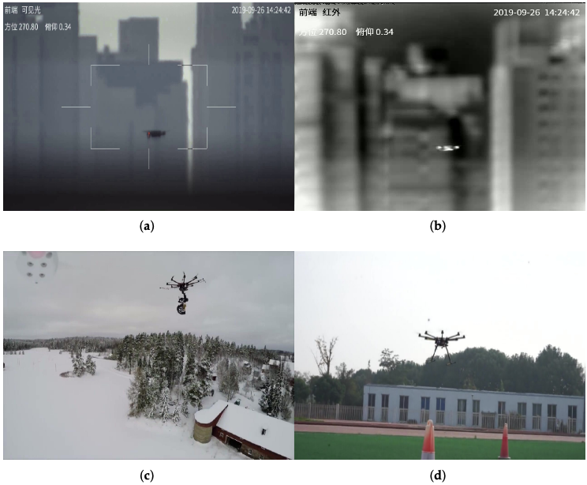
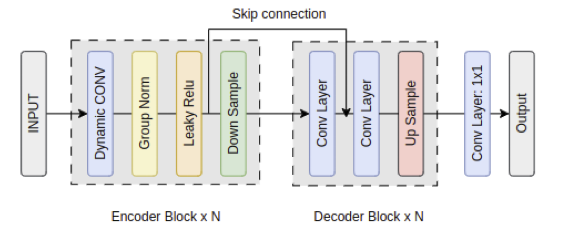
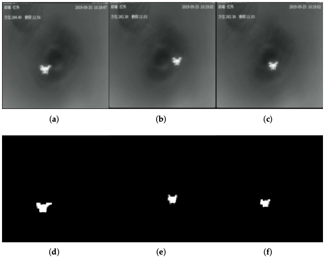
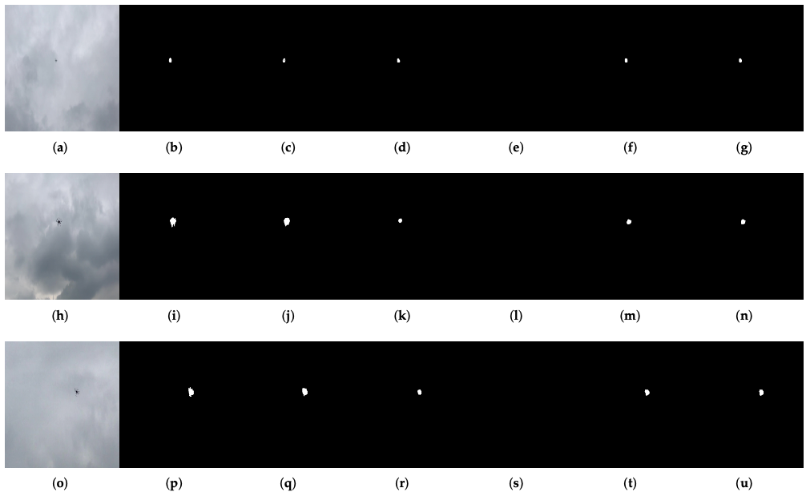
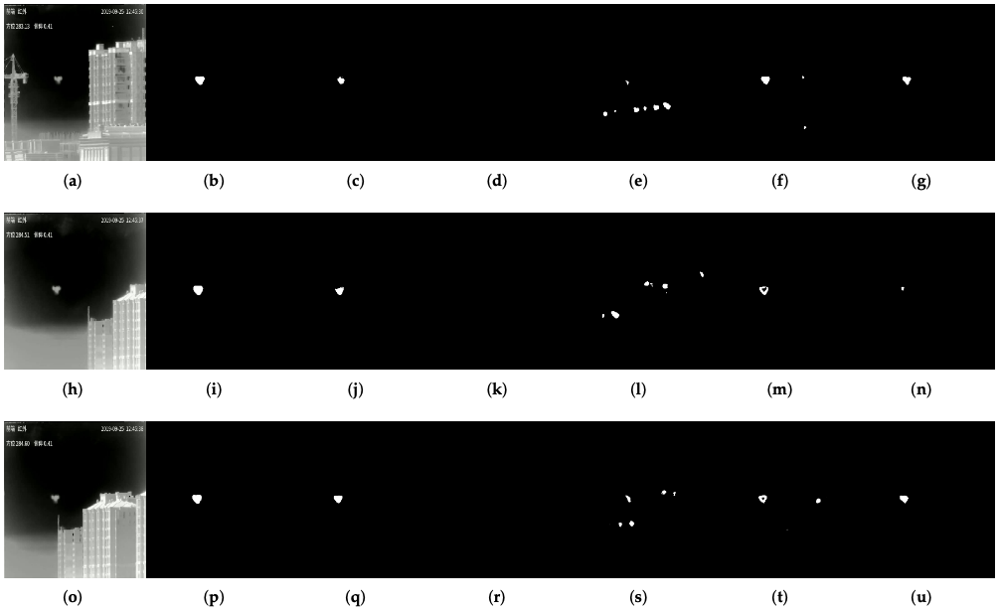
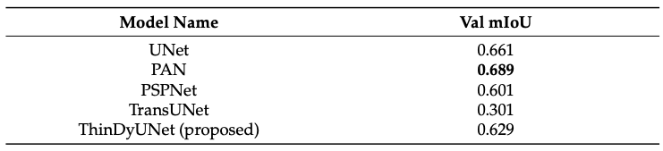
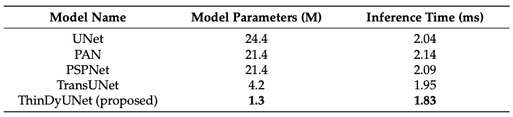

<div id="top" align="center">
  
# UAV Semantic Segmentation and ThinDyUNet Model 
**Mitigating UAV Intrusion Threats: A Semantic Segmentation Dataset and Real-Time Localization Model for Anti-UAV Applications**
  
  Sang-Chul Kim and Yeong Min Jang
  
<a href="#license">
  
</a>  
  
</div>

## Table of Contents
- [Overview](#overview)
- [Dataset Download](#dataset)
- [Results](#results)
  - [mIoU](#miou) 
  - [Model size](#size)
- [Run](#run)

## Overview
UAV semantic segmentation dataset


ThinDyUNet model


## Dataset Download

Sample input and mask


The dataset can be downloaded on the following link

[Input data](https://wicomai.synology.me:5001/sharing/cQy7sbmfF)
[Labels data](https://wicomai.synology.me:5001/sharing/Hyczhpn2h)

Password: a.Ay6rWR

The dataset is developed by integrating three existing datasets:
1. Jiang, N.; Wang, K.; Peng, X.; Yu, X.; Wang, Q.; Xing, J.; Li, G.; Ye, Q.; Jiao, J.; Han, Z.; et al. Anti-UAV: A Large-Scale Benchmark for Vision-based UAV Tracking. T-MM 2021. [Link](https://doi.org/10.1109/TMM.2021.3128047)
2. Zhao, J.; Zhang, J.; Li, D.; Wang, D. Vision-Based Anti-UAV Detection and Tracking. IEEE Transactions on Intelligent Transportation Systems 2022, PP, 1–12. [Link](https://doi.org/10.1109/TITS.2022.3177627)
3. UAV images and bounding box gathered randomyl from various sources

## Results
Inference on RGB image input


Inference on IR image input


### Val mIoU


### Model size


### How to run the code
- Training \
```python train_{model name}.py```
- Testing \
```python test_{model name}.py```

Model name:
1. thindyunet
2. unet
3. pan
4. pspnet
5. transunet

